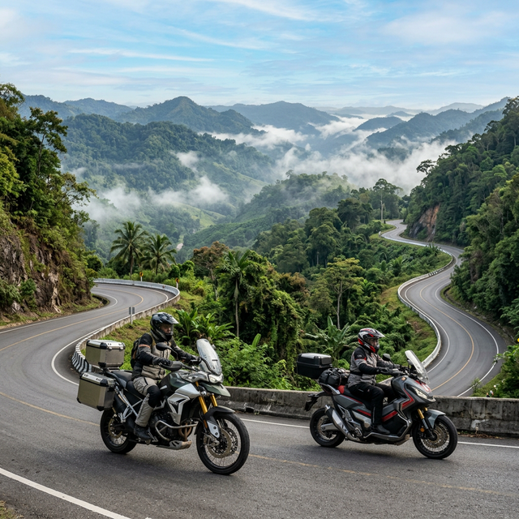

import { Card, CardGrid, LinkCard, Aside } from '@astrojs/starlight/components';
import TripBuilder from '../../components/TripBuilder';

<TripBuilder client:load />

# 🏍️ The Mae Hong Son Loop: 1,864 Curves of Pure Freedom

  <h3>📱 Save for Offline Use</h3>
  
Don't lose your way in the mountains. Save this guide to your phone's home screen for instant offline access.

  <button id="pwa-install-button">📥 Install Offline Guide</button>

Listen, if you're reading this, you're either already in Chiang Mai with a helmet in your hand or you've been staring at Google Maps for weeks. Either way, **welcome home.**

The Mae Hong Son loop isn't just a road trip; it's a rite of passage. 600 kilometers, thousands of gear shifts, and enough stunning views to break your Instagram feed. I've done this trip more times than I can count, and this wiki is everything I wish I knew the first time I nearly cooked my brakes heading into Pai.

---
## ⚡ [The Quick & Dirty: Everything at a Glance](/route/map)

Don't want to dig through ten pages? Here is the "expert's shortcut" to a successful loop.

| Stat | The Reality |
| :--- | :--- |
| **Duration** | **4 Days** is the sweet spot. 3 is a rush, 5 is a holiday. |
| **Best Bike** | **Honda ADV 160** (Scooter), **Honda Rebel 300** (Cruiser), or **Honda NX500** (Pro/Two-up). |
| **Direction** | **Clockwise** (Mae Sariang first) for an easy start, or **Counter-Clockwise** (Pai first) to jump into the deep end. |
| **Best Time** | **November to February.** Perfect temperatures, clear skies. |
| **Gas Policy** | If you see a pump and you're at half tank, **fill it.** |

<LinkCard 
    title="The Route — Directions, Shortcuts & Offline Maps" 
    description="Don't rely on spotty 4G in the mountains. Plan the route before you leave." 
    href="/route/map" 
/>

---

## 🏗️ [Rentals: Secure Your Steed](/essentials/rentals)
The loop will punish a bad bike. Don't rent a "lemon" from a corner shop just because it's 50 THB cheaper.

*   **The Go-To Shop:** [**Mango Bikes**](/essentials/rentals) (Transparent pricing, well-maintained).
*   **The Big Boy Choice:** [**Tony's Big Bikes**](/essentials/rentals) for proper 500cc+ touring.
*   **The Price:** Expect **300-500 THB/day** for a solid scooter, and **1,200+ THB** for a big bike.
*   **Expert Tip:** Take a video of the bike when you rent it. Every scratch. Every dent. Cover your assets.

<LinkCard 
    title="Scooter vs. Manual? Which is for you?" 
    icon="setting" 
    href="/essentials/rentals"
    description="If you aren't 100% confident with a clutch, click here to see why a maxi-scooter is your best friend."
/>

---

## 🏨 [Accommodation: The "No-Regrets" List](/towns/pai)

The loop is usually done in 3 main stops. Click below to see the full detailed guide for each town.

<CardGrid>
    <LinkCard 
        title="PAI: The Social Stop" 
        icon="moon"
        href="/towns/pai"
        description="Stay at Pai Chan or Reverie Siam. Check out the full food and bed list here."
    />
    <LinkCard 
        title="MAE HONG SON: The Cultural Core" 
        icon="moon"
        href="/towns/mae-hong-son"
        description=" lakeside guesthouses, night markets, and temple views. Full guide here."
    />
    <LinkCard 
        title="MAE SARIANG: The Quiet Gem" 
        icon="moon"
        href="/towns/mae-sariang"
        description="Riverside teak wood and zero crowds. See why it's my favorite stop."
    />
</CardGrid>

---

## 🚨 [Safety: Don't Be a Statistic](/safety)

<Aside type="caution" title="Respect the Curves">
    The road from Chiang Mai to Pai alone has **762 curves.** People crash here every single day because they think they're Marc Márquez.
</Aside>

1.  **Watch for Gravel:** Trucks spill sand on corners. Treat every blind apex like it's covered in marbles. [Read more on road hazards](/safety).
2.  **Engine Braking:** If you're on a scooter, **don't ride the brakes** all the way down the hills. [See the brake safety guide](/safety).
3.  **Insurance:** Does your home travel insurance cover motorcycles? [Check the insurance requirements](/safety).

<LinkCard 
    title="View Full Safety & Insurance Guide" 
    icon="warning" 
    href="/safety"
/>

---

## 🎒 [Packing: Essentials Only](/essentials/gear)
Pack light. Whatever you think you need, subtract 30%.
*   **Rain Gear:** Even in the dry season, the mountains can surprise you.
*   **Warmer Layers:** It gets **cold** at 5:00 AM in the mountains.
*   [**View Full Packing List & Gear Guide**](/essentials/gear)

---

## 📍 Essential Routes

*   **Highway 1095:** The legendary "Road to Pai".
*   **The Ban Rak Thai Detour:** A Chinese tea village on the Myanmar border. Don't skip this.
*   **The Cave Lodge:** Adventure capital of the north near Soppong.

---

### 📸 Join the Legend
Tag your photos with **#MHSWiki** on Instagram. We're building a community of riders who survived the 1,864.

---

*Found a mistake? This is a wiki! Feel free to suggest edits or join our discord.*
